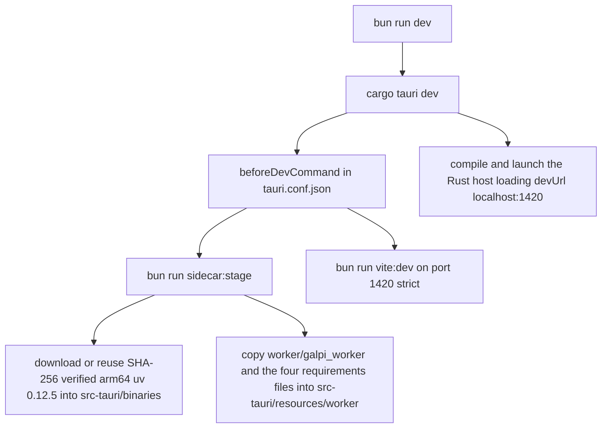

# Quickstart & Task Routing

This is the entry page for a coding agent working in Galpi. It covers four
things: what the product is, how to get a dev environment running, which gate
commands prove your change, and where to route any given task in this wiki.
Everything here is a summary; the linked page owns the details.

## What Galpi is

Galpi (갈피) is a local-first macOS desktop app for Korean meetings: it records
the microphone or imports an audio file, runs speaker-diarized transcription
locally, and can optionally send the transcript to an OpenAI-compatible API to
produce structured Korean meeting minutes in Markdown. It is a 0.1.0
development build that ships **only for Apple Silicon Macs on macOS 14+**; the
DMG is unsigned/notarization-pending.

One product, three runtimes, one repeated shape:

| Runtime | Root | Role |
|---|---|---|
| TypeScript webview | `src/` | Domain contracts, pure state machines, controllers, DOM UI; `TauriBackend` + Zod parsing at the IPC edge |
| Rust/Tauri host | `src-tauri/src/` | Window, settings, secrets, CoreAudio recording, Python process supervision; `Application` facade over ports |
| Python sidecar | `worker/galpi_worker/` | Qwen3 (default) and WhisperX transcription engines, pyannote diarization, minutes refinement |

The runtimes connect through exactly two channels: Tauri IPC (`invoke` in,
`job-event`/`recording-event` out) between webview and host, and a versioned
JSONL-over-stdout protocol between host and worker subprocess. Transcription
and diarization never leave the machine; only an explicit AI-minutes run sends
data to an external API.

Deep maps: [architecture/system-overview](architecture/system-overview.md) ·
frontend: [architecture/frontend](architecture/frontend.md) · host:
[architecture/rust-host](architecture/rust-host.md) · worker:
[architecture/python-worker](architecture/python-worker.md) · protocol:
[architecture/worker-protocol](architecture/worker-protocol.md).

## Set up a dev environment

Requirements (from the README quick start):

- macOS 14 or later, Apple Silicon
- Rust 1.88 or later (the MSRV enforced in `src-tauri/Cargo.toml`)
- Bun 1.3 or later (`packageManager: bun@1.3.14`)
- Tauri CLI 2.11.4

```bash
cargo install tauri-cli --version 2.11.4 --locked
bun install
bun run dev
```

You do **not** preinstall Python, ffmpeg, or WhisperX globally. The staged
sidecars and app-private Python environment supply everything at run time.



The dev boot chain: one command fans out into sidecar staging and the Vite dev server before the Tauri host compiles.

What `bun run dev` actually does: `package.json` maps it to `cargo tauri dev`,
and `src-tauri/tauri.conf.json` sets `beforeDevCommand` to
`bun run sidecar:stage && bun run vite:dev`. So every dev launch first runs
`scripts/stage-sidecars.ts`, which fetches the pinned arm64 `uv` archive,
verifies both archive and binary SHA-256 checksums before installing it at
`src-tauri/binaries/uv-aarch64-apple-darwin`, and then copies
`worker/galpi_worker` (skipping `__pycache__`/`.pyc`) plus the four
requirements files into `src-tauri/resources/worker`. Vite then serves the UI
on port 1420 (`--strictPort`, matching `devUrl`) and Tauri builds and opens the
app window. The same staging runs before a production build via
`beforeBuildCommand`.

**First run inside the app:** open `설정` (Settings), save a Hugging Face token
if the pyannote diarization model has not been downloaded yet, then press
`로컬 엔진 준비` (Prepare local engine). The first prepare installs an
app-private Python 3.12 environment and downloads several GB of models; a
failed prepare is safely resumable by pressing the same button. The two engine
presets install into separate virtualenvs, so preparing one never disturbs the
other. Full trace: [workflows/engine-setup](workflows/engine-setup.md) and
[concepts/engines-and-environment](concepts/engines-and-environment.md).

## Verification gates

`package.json` is the canonical command map. **Bun is the only driver — run
`bun test`, never `npm test`** (`engines.bun >= 1.3.0`, `packageManager`
pinned; npm is not a valid gate in this repo).

| Command | What it runs |
|---|---|
| `bun run check` | `architecture:check` (the fence) → `biome lint .` → `tsc --noEmit` |
| `bun test` | Frontend unit tests (Bun runner, happy-dom for DOM suites) |
| `bun run check:rust` | `cargo fmt --check` → `cargo clippy --all-targets -- -D warnings` → `cargo test --all-targets` (all with `--manifest-path src-tauri/Cargo.toml`) |
| `bun run check:worker` | `uvx ruff check worker` → `uvx ruff format --check worker` → `PYTHONPATH=. python3 -m unittest discover -s worker/tests -t .` (needs `uv`/`uvx` on PATH) |
| `bun run check:all` | `check` → `bun test` → `check:rust` → `check:worker` |
| `bun run vite:build` | `tsc --noEmit && vite build` — emits `dist/` for `frontendDist` |

For full manual coverage of the Python types, the README additionally lists
`uvx basedpyright --pythonpath <WhisperX Python path>`. CI runs three parallel
`macos-15` jobs mirroring the frontend/Rust/worker gates on every push to
`main` and every PR; the tag-triggered release workflow only packages. What
each gate covers, per-runtime test conventions, and the rules for adding tests:
[testing/verification-gates](testing/verification-gates.md).

## Task routing map

Route your task through this hierarchy before touching code:

| If your task is… | Read first | Then work in |
|---|---|---|
| Layering / boundary questions ("where does this code belong?") | [architecture/system-overview](architecture/system-overview.md) and the normative `docs/ARCHITECTURE.md`; `scripts/check-architecture.ts` outranks prose | Run `bun run architecture:check` after any move |
| Worker events or the JSONL protocol | [architecture/worker-protocol](architecture/worker-protocol.md) | `worker/galpi_worker/protocol.py`, `src-tauri/src/domain/worker.rs`, the frontend event schema, and the job reducer — one change set, one commit |
| A new IPC command | [architecture/rust-host](architecture/rust-host.md) + [architecture/frontend](architecture/frontend.md) | `src-tauri/src/adapters/inbound/tauri.rs`, register it in `composition.rs`; frontend side via `src/domain/backend.ts` and the Zod schemas in `src/adapters/tauri-backend.ts` |
| Microphone recording | [workflows/recording](workflows/recording.md) | `src-tauri/src/adapters/outbound/recording/` |
| AI meeting minutes (refine) | [workflows/ai-minutes](workflows/ai-minutes.md) | `worker/galpi_worker/refine.py` + `minutes_*.py`, host side `refinement.rs` |
| First-run engine setup / readiness | [workflows/engine-setup](workflows/engine-setup.md) + [concepts/engines-and-environment](concepts/engines-and-environment.md) | `src-tauri/src/adapters/outbound/setup.rs`, `worker/galpi_worker/preparation.py` |
| Tokens, keys, external APIs, bundled runtimes | [integrations/external-services](integrations/external-services.md) | `secrets.rs`, `settings.rs`, `assistant_stream.py` |
| Building, staging, releasing | [operations/build-and-packaging](operations/build-and-packaging.md) | `scripts/stage-sidecars.ts`, `scripts/build-dmg.ts`, `.github/workflows/release.yml` |
| Meetings, artifacts, output naming | [concepts/meetings-and-artifacts](concepts/meetings-and-artifacts.md) | `src-tauri/src/domain/artifact.rs`, `worker/galpi_worker/artifacts.py` |
| Jobs, cancellation, error codes, state machines | [concepts/jobs-and-cancellation](concepts/jobs-and-cancellation.md) | `src-tauri/src/application/jobs.rs`, `src/application/job-machine.ts` |
| Python worker internals | [architecture/python-worker](architecture/python-worker.md) | `worker/galpi_worker/` |
| What each test gate covers | [testing/verification-gates](testing/verification-gates.md) | `src/**/*.test.ts`, `src-tauri/src/application/tests.rs`, `worker/tests/` |

## Conventions that bite fastest

- **Copy language split.** User-facing copy is Korean (e.g. `전사 시작`,
  `_화자별.txt`); protocol and error identifiers stay stable ASCII (event
  `type` values, `AppError` codes). Do not translate either direction.
- **One dependency rule.** Dependencies point inward to `domain` in all three
  runtimes; ports are owned by the consuming inner layer and implemented by
  adapters; framework code (Tauri, Zod, CPAL, `tokio::process`) lives only in
  adapters and composition. `docs/ARCHITECTURE.md` is normative and
  `scripts/check-architecture.ts` is the executable fence — a passing fence
  outranks prose.
- **The protocol is one change set.** The Python `EventWriter` events, the Rust
  parser, the frontend event schema, and the job reducer must change in the
  same commit. Never change a protocol version, event, or field in Python
  alone.
- **Generated trees are not source.** `.gitignore` excludes `node_modules/`,
  `dist/`, `src-tauri/target/`, `src-tauri/gen/`, `src-tauri/binaries/`,
  `src-tauri/resources/worker/`, and `**/__pycache__/`. Never edit the staged
  worker copy under `src-tauri/resources/worker/` — edit `worker/` and let
  staging copy it.
- **The project documents its own agent rules.** Read `AGENTS.md` first, then
  the nested `src-tauri/AGENTS.md` and `worker/AGENTS.md` when working in those
  trees, and the `.issueops/` family (`CONSTITUTION.md` at session start,
  `TESTING.md` before writing tests, `CAUTIONS.md` for known traps, `ADR.md`
  for structural decisions). Source code and current command output are the
  final authority.
- **Subscribe before invoke.** In frontend work, subscribe to Tauri events
  before invoking the operation that emits them, and expect IPC-bound behavior
  to be dead in a plain browser (it renders, but every `invoke`/`listen`
  fails) — see `.issueops/cautions/`.
